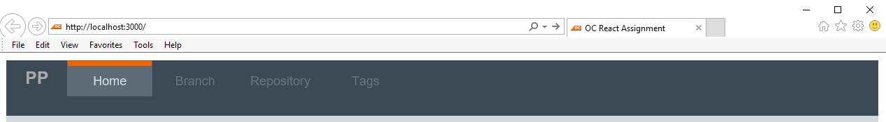
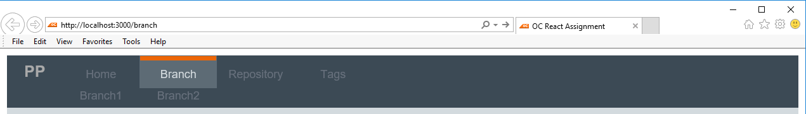
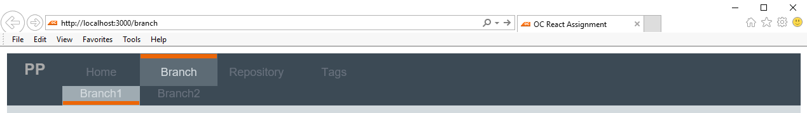
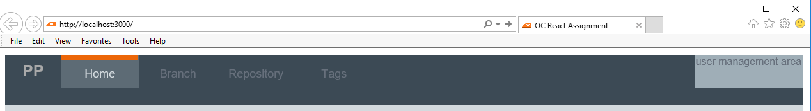

# Navigation Component

Navigation is one of the MOST common components what comes to the Frontend development. End users have
several devices and expect that their favourite web site has a working navigation that
works with any device they are using it.

## Assignment

In this assignment you have been asked to implement a reusable navigation component with React.
There is no requirement to implement any API / Backend functionality. 
You can use whatever method you wish to load the API example data to your component.

You have given the following guidelines from UX designer for the desktop view, 
but feel free to use your creativity with mobile view.

#### Mockups with some additional info.


- Logo should always be visible but not selectable.
- Highlight on main level items should be on top.


- Second level should be rendered if Main item contains them.


- Highlight of second level items should be on bottom


- Hovering over User area reveales the placeholder.

#### API Example


```json
[
  {
    "name": "Home",
    "url": "/home",
    "key": 100,
    "subItems": []
  },
  {
    "name": "Branch",
    "url": "/branch",
    "key": 200,
    "subItems": [
      { "name": "Branch1", "url": "/branch1", "key": 201 },
      { "name": "Branch2", "url": "/branch2", "key": 202 }
    ]
  },
  {
    "name": "Repository",
    "url": "/repos",
    "key": 300,
    "subItems": []
  },
  {
    "name": "Tags",
    "url": "/tags",
    "key": 400,
    "subItems": []
  },
]
```


## Prerequisites

  The project is set as ready as possible, but still in order to finish you need to install [NodeJS](https://nodejs.org/en/).


### Requirements / Restrictions

Only few requirements:

  * Component is reusable.
  * Component is usable also with mobile devices.
  * Component supports browsers: IE11, Chrome
  * It works with example API data!
  * Optional: Add routing and placeholder components. [Example](./assignment/img/design/2nd_lvl_highlighted.png)

Some guidelines

  + colors are predefined in `_colors.scss `.
  + keep it simple
  + keep it clean
  + no need to support long strings and several navigation items

  Feel free to use any react libraries you feel comfortable to use. 
  There are no correct or incorrect solution as long as it is yours solution.

### Development environment

    * clone this repository to your local environment.
    * open command prompt and cd into project. ` cd react-test `.
    * install all dependencies with npm ` npm install ` .
    * [Start] ` npm run start ` - Starts development environment and watches the changes.
    * [Build] ` npm run build ` - Bundles and minifies everything for production build.


Test assignments frame has been built using the boilerplate: ` create-react-app `, which
has good [documentation](https://github.com/facebookincubator/create-react-app).


Good luck!.
